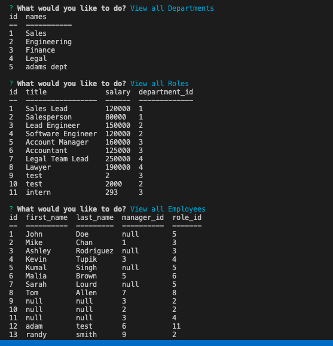
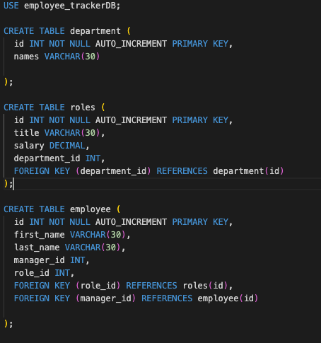
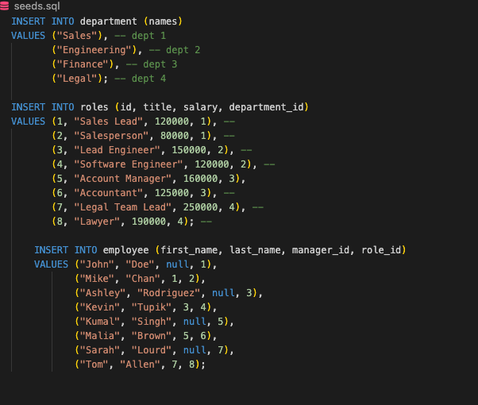

# Employee-Tracker

## Descripton
This project is used to track employees, the departments and roles that they hold within an company.  You use the server and mySQL to process these requests with the code in the server and the schema.sql & seeds.sql files.

## My Task
My task was to write a server, schema and seeds files to get the terminal to update when new departments, roles or employees are introduced and added to the company.

## List of Technologies used
- npm
- javascript
- node.js
- inquirer
- mySQL
- Databases

## Github URL
https://github.com/mclanea92/Employee-Tracker

## Video Tutorial


## Acceptance Criteria

```md
GIVEN a command-line application that accepts user input
WHEN I start the application
THEN I am presented with the following options: view all departments, view all roles, view all employees, add a department, add a role, add an employee, and update an employee role
WHEN I choose to view all departments
THEN I am presented with a formatted table showing department names and department ids
WHEN I choose to view all roles
THEN I am presented with the job title, role id, the department that role belongs to, and the salary for that role
WHEN I choose to view all employees
THEN I am presented with a formatted table showing employee data, including employee ids, first names, last names, job titles, departments, salaries, and managers that the employees report to
WHEN I choose to add a department
THEN I am prompted to enter the name of the department and that department is added to the database
WHEN I choose to add a role
THEN I am prompted to enter the name, salary, and department for the role and that role is added to the database
WHEN I choose to add an employee
THEN I am prompted to enter the employee’s first name, last name, role, and manager, and that employee is added to the database
WHEN I choose to update an employee role
THEN I am prompted to select an employee to update and their new role and this information is updated in the database 
```

## Tests
To test this application, you will have to download it to your code editor.  Then download the npm packages that are required.  You will then run mysql and add the schema & seeds files to get the starter tables made with the current employees.  After that has been completed, you will run node server.js and the prompts will start for the user to work with.

## Questions
If you have any questions about this project, please feel free to contact me at mclanea92@gmail.com

## Screenshots

The photo below shows my terminal with after the prompts have been run when testing this application



The photo below shows how the schema is set up for the database and what is required



This final photo is of the seeds file that fills in the schema database with the beginner info

